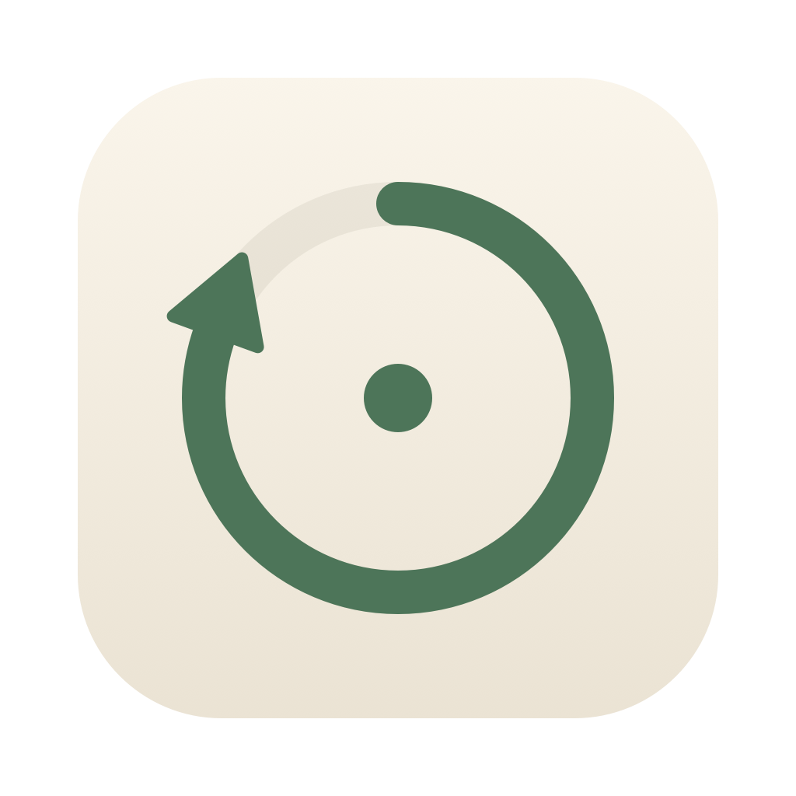
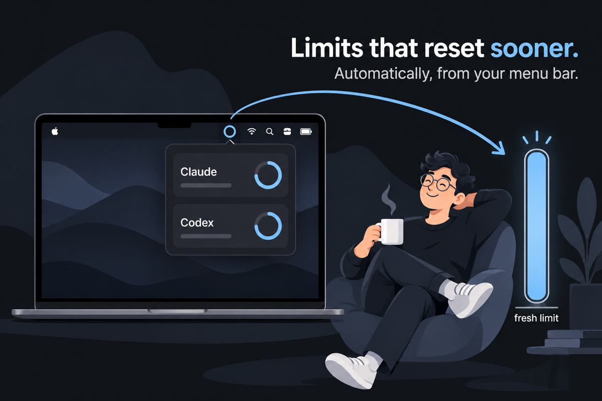
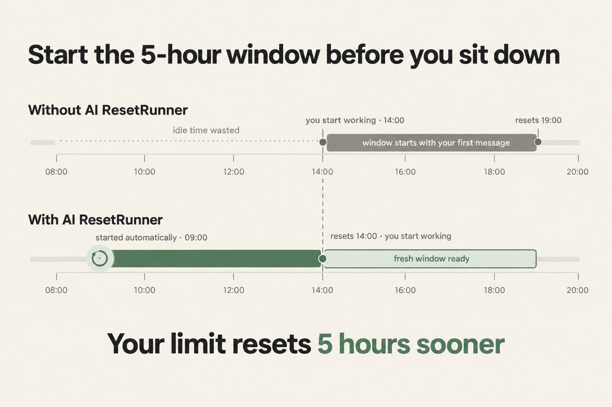
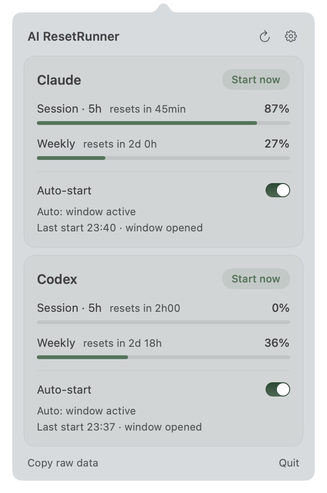
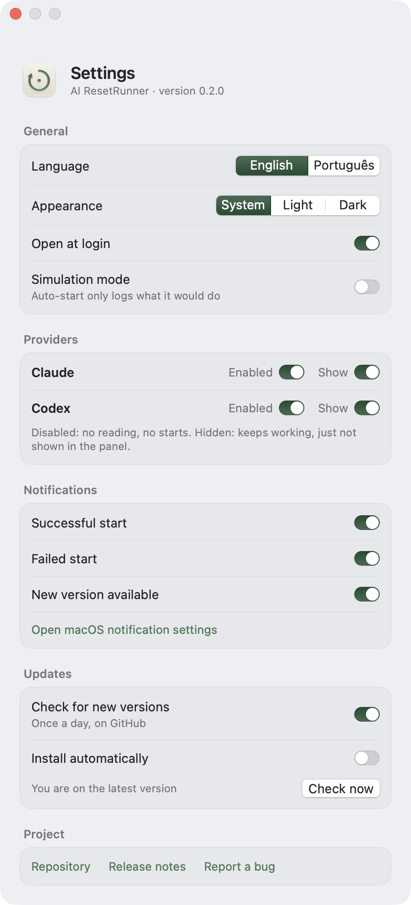

<p align="center">
  
</p>

<h1 align="center">AI ResetRunner</h1>

<p align="center">
  <b>Get your Claude Code and Codex limits back sooner.</b><br>
  A small macOS menu bar app that starts your 5-hour usage window while you are away,<br>
  so a fresh window is ready when you sit down to work.
</p>

<p align="center">
  <a href="https://github.com/almeidasrenato/ai-reset-runner/releases/latest"><b>Download</b></a> ·
  <a href="#how-it-works">How it works</a> ·
  <a href="#install">Install</a> ·
  <a href="#faq">FAQ</a>
</p>

<p align="center">
  
</p>

## Why this exists

Claude Code (Claude Pro/Max) and Codex (ChatGPT Plus/Pro) meter your usage in **5-hour windows**.
A window does not start on a schedule. It starts with **your first message**, and it resets 5 hours later.

So your idle time is wasted. If you take the morning off and start coding at 14:00, your window
runs from 14:00 to 19:00. Hit the limit at 16:00 and you wait until 19:00, even though you did not
use anything all morning.

**AI ResetRunner fixes that.** When no window is running, it sends one tiny message (`ok`) with the
cheapest model. The window starts right away, while you are away, and it resets earlier.

<p align="center">
  
</p>

## What you gain

- **Limits reset hours sooner.** Your idle time now counts toward a window. When you start working, the reset is close or a fresh window is already there.
- **More usable windows per day.** Back-to-back windows during the day instead of one late window.
- **No babysitting.** No need to remember to send a message at 9 AM. The app watches both providers and acts only when needed.
- **Both limits at a glance.** The 5-hour session and the weekly limit of Claude Code and Codex, right in your menu bar.
- **Almost free.** Each start is one short message to the smallest model (Claude Haiku, a light Codex model).

## Screenshots

<p align="center">
  
  &nbsp;&nbsp;
  
</p>

## Features

- Menu bar panel with the 5-hour session and weekly limits of **Claude Code** and **Codex**.
- **Start now** button per provider. 45 seconds later the app reads the usage again to confirm that the window really opened.
- **Appearance**: follow the system, or keep the app always light or always dark.
- **Auto-start** per provider (off by default): starts a window by itself when none is active.
- **Simulation mode**: auto-start only logs what it would do.
- **Settings**:
  - language (English or Portuguese);
  - open at login;
  - enable/disable and show/hide each provider;
  - notifications for successful starts, failed starts and new versions;
  - automatic updates from GitHub Releases.
- System notifications, exponential back-off on HTTP 429, and an immediate check when the Mac wakes up.

## How it works

The app reads your usage the same way the official tools do, and uses the official CLIs to start a window.

| | Claude Code | Codex |
|---|---|---|
| **Reads usage from** | `claude --print --no-session-persistence "/usage"` (fallback: the OAuth usage endpoint, with the token that Claude Code keeps in the Keychain) | `chatgpt.com/backend-api/wham/usage`, with the token in `~/.codex/auth.json` |
| **Starts a window with** | `claude -p "ok" --model haiku --no-session-persistence` | `codex exec --ephemeral -m gpt-5.6-luna "ok"` |
| **"No active window" means** | no reset time, or a reset time in the past | `reset_after_seconds >= limit_window_seconds` |

### Safety rules

Auto-start only fires when **all** of these are true:

1. Auto-start is on for that provider.
2. The usage was read just now (less than 5 minutes ago). Stale data never triggers a start.
3. No window is active. A window that opened a minute ago also shows 0%, so the rule is "no window", never "0% used".
4. The weekly limit is below 100%.
5. The last start for that provider was at least **4 h 50 min** ago. This lock includes manual starts and is saved on disk.

### Privacy

- Both CLIs run in their ephemeral modes, from a dedicated folder
  (`~/Library/Application Support/AIResetRunner/workdir`). The `ok` conversation is not saved to your
  history. As a safety net, the app deletes any session file a start might leave behind, and only
  that file.
- The app **only reads** credentials. It never refreshes, writes, sends elsewhere or logs your tokens.
- There is no server, no analytics and no account. The only network calls go to Anthropic, OpenAI and GitHub (update checks).

## Install

**Requirements:**
- macOS 14 or later.
- [Claude Code](https://docs.anthropic.com/en/docs/claude-code) and/or [Codex CLI](https://github.com/openai/codex), installed and signed in with a subscription.

### Download

1. Download `AIResetRunner.zip` from the [latest release](https://github.com/almeidasrenato/ai-reset-runner/releases/latest).
2. Unzip it and move `AIResetRunner.app` to `/Applications`.
3. The app is not notarized by Apple, so macOS blocks the first launch. Remove the quarantine flag once:

   ```bash
   xattr -dr com.apple.quarantine /Applications/AIResetRunner.app
   ```

   Or open the app once, then go to **System Settings › Privacy & Security** and click **Open Anyway**.
4. Look for the small rings in the menu bar. Turn on **Auto-start** for the providers you use.

Later versions can install themselves from **Settings › Updates**.

### Build from source

You need Xcode or the Command Line Tools (`xcode-select --install`).

```bash
git clone https://github.com/almeidasrenato/ai-reset-runner.git
cd ai-reset-runner
make install
```

Other commands:

```bash
make test     # unit tests
make run      # build and run from ./build without installing
make logs     # stream the app's logs
make icon     # regenerate the app icon
make release  # after bumping VERSION: build, zip and publish a GitHub release
```

### Advanced settings

Optional overrides, if the app cannot find a CLI or you want another Codex model:

```bash
defaults write com.local.airesetrunner claudePath /path/to/claude
defaults write com.local.airesetrunner codexPath /path/to/codex
defaults write com.local.airesetrunner codexModel gpt-5.6-luna
```

By default the app looks in `~/.local/bin`, `~/.claude/local`, `/opt/homebrew/bin` and
`/usr/local/bin`, and then asks your login shell.

## FAQ

**Does it use my quota?**
Yes, a very small amount: one `ok` message to the smallest model, at most once every 4 h 50 min per provider.

**Will it start a new window while I am working?**
No. It only acts when no window is active. While you use Claude Code or Codex, a window is always running.

**Does it work with API keys?**
No. API usage is billed per token and has no 5-hour window. This app is for subscriptions.

**Is it allowed?**
It sends a normal message through the official CLIs, the same as if you typed it yourself. Still, check
that this use fits the terms of your plan.

## Disclaimer

This is an unofficial tool. It is not affiliated with Anthropic or OpenAI. The usage endpoints it
reads are undocumented and may change.

## Credits

The usage endpoints, the parsing and the back-off policy were learned from
[Codenotch](https://github.com/vinzdg/codenotch) by Vinz (MIT). Its copyright notice is kept in
[LICENSE](LICENSE) and in the derived source files. Illustrations were generated with ChatGPT.

## License

[MIT](LICENSE)
